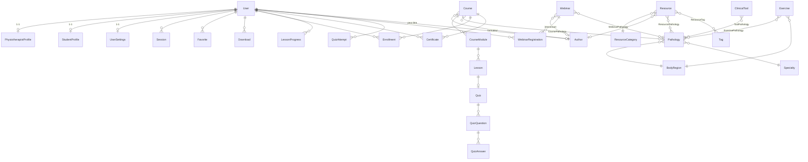

# Modèle de données — KINEDOK ACADÉMIE

Le schéma complet est fourni dans deux formats équivalents :

- [`db/schema.prisma`](../db/schema.prisma) — Prisma / PostgreSQL ;
- [`db/supabase.sql`](../db/supabase.sql) — DDL SQL + politiques RLS pour Supabase.

La version front-end livrée utilise exactement les mêmes entités et les mêmes
noms de champs (`src/data/*.ts`), ce qui permet de réutiliser les fichiers de données
comme *seed* sans transformation.

## 1. Vue d'ensemble



## 2. Décisions de conception

**Pathologie = pivot du modèle.** Ressources, outils, exercices, formations et
webinaires se rattachent aux pathologies par des tables de liaison. C'est ce qui
permet à `/pathologies/[slug]` d'agréger tout le contenu d'une pathologie en une
seule page — la fonctionnalité la plus différenciante de la plateforme
(`KA.data.forPathology()` en front, une jointure en SQL).

**Taxonomies par clés, libellés par i18n.** `BodyRegion.id = 'genou'`,
`ResourceCategory.id = 'protocole'`. Les libellés affichés viennent des
dictionnaires (`taxonomies.regions.genou`), pas de la base : ajouter une langue
ne demande aucune migration. La table `TermLabel` n'existe que pour exposer des
libellés traduits via une API publique.

**Profils séparés.** Un étudiant n'a pas de numéro d'ordre, un professionnel n'a
pas d'année d'études : `PhysiotherapistProfile` et `StudentProfile` évitent une
table `User` criblée de colonnes nulles, conformément au cahier des charges
(« ne pas imposer d'informations professionnelles aux étudiants »).

**Course → Module → Lesson → Quiz → Question → Answer.** Hiérarchie explicite
plutôt qu'un JSON opaque : elle rend possibles la progression par leçon, la
reprise, le calcul du pourcentage, la correction serveur des quiz et
l'attribution automatique du certificat.

**`QuizAnswer.isCorrect` ne sort jamais de l'API publique.** La correction se
fait côté serveur (`POST /api/quiz/:id/attempt`), le client ne reçoit que le
score. En front-end pur, la correction est locale — c'est une limite assumée,
documentée dans [`ROADMAP.md`](ROADMAP.md).

**Fichiers hors base.** `fileUrl` pointe vers Supabase Storage / S3. Aucun PDF ni
vidéo n'est stocké en base. Les contenus `access = 'premium'` sont servis par URL
signée à durée limitée.

**Statut des webinaires calculé, jamais stocké.** `startsAt + durationMin` et
l'heure courante suffisent à déduire *à venir / en direct / replay / terminé*
(`KA.data.webinarStatus()`). Un statut stocké se désynchronise toujours.

**Monétisation préparée, non implémentée.** `Plan`, `Subscription`, `Access` et
`User.premium` existent ; aucun paiement n'est branché. Introduire une offre
payante ne nécessitera pas de refonte : le contrôle passe déjà par
`KA.auth.canAccess(item)`.

## 3. Correspondance fichiers front ↔ tables

| Fichier livré | Table(s) |
| --- | --- |
| `src/data/taxonomies.ts` | `BodyRegion`, `Specialty`, `ResourceCategory`, énumérations |
| `src/data/authors.ts` | `Author` |
| `src/data/pathologies.ts` | `Pathology` |
| `src/data/resources.ts` | `Resource`, `ResourceTag`, `ResourcePathology` |
| `src/data/courses.ts` | `Course`, `CourseModule`, `Lesson`, `Quiz`, `QuizQuestion`, `QuizAnswer` |
| `src/data/webinars.ts` | `Webinar`, `WebinarPathology` |
| `src/data/tools.ts` | `ClinicalTool`, `ToolPathology` |
| `src/data/exercises.ts` | `Exercise`, `ExerciseTag`, `ExercisePathology` |
| `ka.users` (localStorage) | `User`, `PhysiotherapistProfile`, `StudentProfile`, `UserSettings` |
| `ka.session` | `Session` |
| `ka.userState.<id>.favorites` | `Favorite` |
| `ka.userState.<id>.downloads` | `Download` |
| `ka.userState.<id>.viewed` | `ResourceView` |
| `ka.userState.<id>.enrollments` | `Enrollment` |
| `ka.userState.<id>.progress` | `LessonProgress` |
| `ka.userState.<id>.quizScores` | `QuizAttempt` |
| `ka.userState.<id>.webinarRegistrations` | `WebinarRegistration` |
| `ka.userState.<id>.certificates` | `Certificate` |
| `ka.userState.<id>.searchHistory` | `SearchHistory` |
| `ka.events` | `AnalyticsEvent` |

## 4. Index et recherche

Index déjà déclarés : `(published, publishedAt)` sur `Resource`,
`(categoryId, regionId, specialtyId, level)` pour les filtres combinés,
`(type, regionId, published)` sur `ClinicalTool`, `(published, startsAt)` sur
`Webinar`, `(userId, createdAt)` sur les tables d'activité.

Recherche plein texte à ajouter après la première migration :

```sql
-- Colonne générée + index GIN par table indexée
ALTER TABLE "Resource" ADD COLUMN search_fr tsvector
  GENERATED ALWAYS AS (
    setweight(to_tsvector('french', coalesce(title, '')), 'A') ||
    setweight(to_tsvector('french', coalesce(subtitle, '')), 'B') ||
    setweight(to_tsvector('french', coalesce(description, '')), 'C') ||
    setweight(to_tsvector('french', coalesce(abstract, '')), 'D')
  ) STORED;

CREATE INDEX resource_search_fr_idx ON "Resource" USING GIN (search_fr);

-- Recherche insensible aux accents (équivalent de KA.format.normalize)
CREATE EXTENSION IF NOT EXISTS unaccent;
CREATE EXTENSION IF NOT EXISTS pg_trgm;   -- tolérance aux fautes de frappe
```

Les **alias de pathologies** (`Pathology.aliases`) doivent être inclus dans le
vecteur de recherche : c'est ce qui fait qu'une requête « tendinopathie
rotulienne » trouve la fiche « tendinopathie patellaire ».

## 5. Points à traiter à la première migration

1. `npx prisma validate` puis `npx prisma migrate dev --name init`.
2. Les contraintes `@@unique` portant sur plusieurs colonnes nullables
   (`Favorite`, `TermLabel`, `Translation`) sont faibles en PostgreSQL, qui
   considère deux `NULL` comme distincts. Les remplacer par des index partiels :

   ```sql
   CREATE UNIQUE INDEX favorite_user_resource_uq
     ON "Favorite" ("userId", "resourceId") WHERE "resourceId" IS NOT NULL;
   ```

3. Ajouter les contraintes de cohérence métier :

   ```sql
   ALTER TABLE "Favorite" ADD CONSTRAINT favorite_one_target CHECK (
     (("resourceId" IS NOT NULL)::int + ("courseId" IS NOT NULL)::int +
      ("webinarId" IS NOT NULL)::int + ("toolId" IS NOT NULL)::int +
      ("exerciseId" IS NOT NULL)::int) = 1
   );
   ALTER TABLE "Review" ADD CONSTRAINT review_rating_range CHECK (rating BETWEEN 1 AND 5);
   ```

4. Seed : reprendre `src/data/*.ts` (les objets correspondent aux modèles), créer les
   taxonomies avant les contenus, puis les liaisons.
